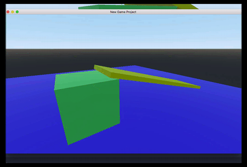

# godot-fpc
First Person Controller for the Godot game engine.

This is the same code that [Jeremy Bullock](https://github.com/turtletooth/) wrote for his (very good IMHO!) tutorial series on Youtube:

https://www.youtube.com/watch?v=0BSlIpJ0wl8

Unfortunately he gave up on Godot and decided to delete his repositories.

I took the liberty to take his code and publish it.

